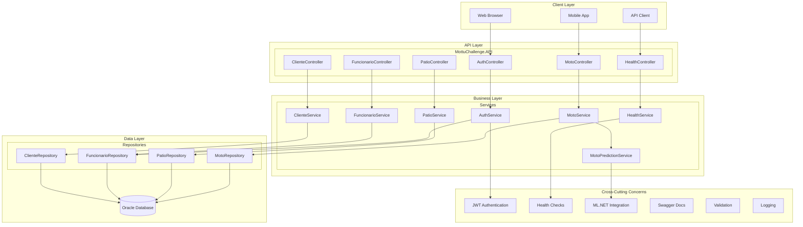

Mottu API - Sistema de Gerenciamento de Pátio de Motos
======================================================


## Índice

- [Visão Geral](#visão-geral)
- [Arquitetura do Sistema](#arquitetura-do-sistema)
- [Tecnologias Utilizadas](#tecnologias-utilizadas)
- [Estrutura do Projeto](#estrutura-do-projeto)
- [Configuração e Execução](#configuração-e-execução)
- [Execução de Testes](#execução-de-testes)
- [Documentação da API](#documentação-da-api)
- [Autenticação e Autorização](#autenticação-e-autorização)
- [Versionamento da API](#versionamento-da-api)
- [Health Checks e Monitoramento](#health-checks-e-monitoramento)
- [Machine Learning (ML.NET)](#machine-learning-mlnet)
- [Exemplos de Uso](#exemplos-de-uso)
- [Exemplos Completos de Requisições](#exemplos-completos-de-requisições)
- [Licença](#licença)

Visão Geral
-----------

A Mottu API é um sistema completo de gerenciamento de pátio de motos desenvolvido em .NET 9.0, oferecendo funcionalidades avançadas para controle de frota, gestão de pátios, funcionários, clientes e integração com machine learning para predição de manutenção preventiva.

Domínio Principal: Sistema de gerenciamento de pátio de motos com controle de vagas, status das motos, funcionários e clientes, incluindo predição inteligente de manutenção.

Arquitetura do Sistema
----------------------

### Diagrama de Arquitetura C4 - Nível de Componentes




### Explicação da Arquitetura

#### Padrão Arquitetural

A aplicação segue o padrão Layered Architecture com separação clara de responsabilidades:

1.  API Layer (Controllers): Responsável pelo tratamento de requisições HTTP, validação de entrada e formatação de respostas

2.  Business Layer (Services): Contém a lógica de negócio, orquestração de operações e validações complexas

3.  Data Layer (Repositories): Gerencia o acesso a dados e operações de persistência

4.  Domain Layer (Models): Define as entidades de domínio e regras básicas de negócio

#### Padrões de Design Implementados

-   Repository Pattern: Abstração do acesso a dados

-   Service Pattern: Encapsulamento da lógica de negócio

-   DTO Pattern: Separação entre modelos de domínio e modelos de API

-   Service Response Pattern: Padronização de respostas da API

-   Strategy Pattern: Implementação do [ML.NET](https://ml.net/) com fallback

#### Fluxo de Dados

```text
Request HTTP → Controller → Service → Repository → Database
                                     ↓
Response HTTP ← Controller ← Service ← Repository ← Database
```

Tecnologias Utilizadas
----------------------

### Backend

-   .NET 9.0 - Framework principal

-   [ASP.NET](https://asp.net/) Core - Framework web

-   Entity Framework Core 9.0.10 - ORM

-   Oracle.EntityFrameworkCore 9.23.90 - Provider Oracle

-   [ML.NET](https://ml.net/) 4.0.2 - Machine Learning

-   xUnit - Framework de testes

-   [BCrypt.Net](https://bcrypt.net/)-Next - Hash de senhas

### Segurança

-   JWT (JSON Web Tokens) - Autenticação

-   BCrypt - Criptografia de senhas

-   [ASP.NET](https://asp.net/) Core Identity - Sistema de autorização

### Documentação e Qualidade

-   Swagger/OpenAPI - Documentação interativa

-   Health Checks - Monitoramento

-   API Versioning - Controle de versões

-   HATEOAS - Hipermídia na API

### Ambientes de Desenvolvimento Suportados

-   Visual Studio 2022 (Recomendado para Windows)

-   Visual Studio Code (Multiplataforma - Windows, Linux, Mac)

-   JetBrains Rider (Alternativa multiplataforma)

Estrutura do Projeto
--------------------

```text

MottuChallenge/
├── MottuChallenge.API/
│   ├── Controllers/          # Controladores HTTP
│   ├── Models/              # Modelos de domínio
│   │   ├── Common/          # Modelos compartilhados
│   │   ├── Auth/            # Modelos de autenticação
│   │   └── ML/              # Modelos de machine learning
│   ├── DTOs/                # Data Transfer Objects
│   ├── Services/            # Lógica de negócio
│   ├── Repositories/        # Acesso a dados
│   ├── Data/               # Contexto do banco
│   ├── Enums/              # Enumerações
│   └── Program.cs          # Configuração principal
├── MottuChallenge.Tests/
│   ├── IntegrationTests/   # Testes de integração
│   └── UnitTests/          # Testes unitários
└── MottuChallenge.sln      # Solução principal

```

Configuração e Execução
-----------------------

### Pré-requisitos

-   .NET 9.0 SDK

-   Oracle Database (ou conexão FIAP)

-   Visual Studio 2022 ou VS Code

### Configuração

1.  Clone o repositório:

```bash

git clone <url-do-repositorio>
cd MottuChallenge

```

1.  Configure a conexão com o banco (appsettings.json)


1.  Execute as migrações do banco caso necessario :

```bash

cd MottuChallenge.API
dotnet ef database update

```

### Execução da Aplicação - Passo a Passo

#### No Visual Studio 2022:

1.  Abra o arquivo `MottuChallenge.sln`

2.  Defina `MottuChallenge.API` como projeto de inicialização

3.  Pressione F5 ou clique em "Executar"

#### No Visual Studio Code:

1.  Abra a pasta do projeto no VS Code

2.  Abra o terminal integrado (Ctrl + `)

3.  Execute os comandos:

```bash

cd MottuChallenge.API
dotnet run
```
## 1. Saída esperada no console:

```text
==============================================
MOTTU API INICIADA COM SUCESSO
URL Principal: http://localhost:5147
Pagina Inicial: http://localhost:5147/
Swagger Docs: http://localhost:5147/swagger
Health Check: http://localhost:5147/health
API Info: http://localhost:5147/api
==============================================

CREDENCIAIS PARA TESTE:
  - **Admin**: usuario=admin_principal, senha=Admin123!
  - **Funcionário**: usuario=funcionario_teste, senha=Func123!
==============================================

VERSÕES DISPONÍVEIS:
  - **v1** - API Estável (Produção)
  - **v2** - Nova Versão (Recursos Avançados)
==============================================

DICAS RÁPIDAS:
  - Use `/api/v1/...` para versão estável
  - Use `/api/v2/...` para novos recursos
  - Obtenha token JWT em: `POST /api/v1/auth/login`
  - Health Check mostra status em tempo real
  - Swagger tem exemplos de todos os endpoints
==============================================
```

1.  Acesse os endpoints principais:

    -   Pagína incial com redirecionamento:  <http://localhost:5147/>

    -   Documentação Interativa: <http://localhost:5147/swagger>

    -   Health Check: <http://localhost:5147/health>

    -   API Info: <http://localhost:5147/api>

Execução de Testes
------------------

### Passo a Passo para Executar Testes

1.  No Visual Studio 2022:

    -   Abra o Test Explorer (Menu Test → Test Explorer)

    -   Execute todos os testes ou selecione categorias específicas

2.  No Terminal/Command Line:

bash

## Navegue até a pasta de testes
cd MottuChallenge.Tests

## Execute os comandos de teste
dotnet test

## Executar apenas testes de integração
dotnet test --filter "FullyQualifiedName~IntegrationTests"

## Executar apenas testes unitários
dotnet test --filter "FullyQualifiedName~UnitTests"

## Executar testes CRUD
dotnet test --filter "FullyQualifiedName~CrudTests"

## Tipos de Testes Implementados

### Testes de Integração

-   AuthTests: Autenticação e validação de tokens

-   BasicApiTests: Endpoints básicos da API

-   CrudTests: Operações CRUD completas

-   HealthCheckTests: Verificação de saúde do sistema

-   ProtectedEndpointsTests: Testes de autorização


## Documentação da API
#### Endpoints Principais
#### Autenticação

  - POST /api/v1/auth/login - Login de funcionários


  - GET /api/v1/auth/validate - Validação de token

  - GET /api/v2/auth/me - Informações do usuário (V2)

#### Pátios

  - GET /api/v1/Patio - Listar pátios

  - GET /api/v1/Patio/{nomePatio} - Obter pátio específico

  - POST /api/v1/Patio - Criar pátio

  - PUT /api/v1/Patio/{nomePatio} - Atualizar pátio

  - GET /api/v1/Patio/com-vagas - Pátios com vagas disponíveis

#### Funcionários

  - GET /api/v1/Funcionario 
  
   Listar funcionários

  - GET /api/v1/Funcionario{usuarioFuncionario}

    Obter funcionário

  - POST /api/v1/Funcionario - Criar funcionário

  - GET /api/v2/Funcionario/patio/{nomePatio}
    
   Funcionários por pátio (V2)

#### Motos
  - GET /api/v1/Moto - Listar motos

  - GET /api/v1/Moto/{placa} - Obter moto específica

  - POST /api/v1/Moto - Criar moto

  - GET /api/v1/Moto/{placa}/prever-manutencao - Predição de manutenção

  - GET /api/v2/Moto/patio/{nomePatio} - Motos por pátio (V2)

#### Clientes
  - GET /api/v1/Cliente - Listar clientes

  - GET /api/v1/Cliente/{usuarioCliente} - Obter cliente

  - POST /api/v1/Cliente - Criar cliente

  - GET /api/v2/Cliente/por-moto/{motoPlaca} Cliente por moto (V2)
#### Testes Unitários

-   BusinessLogicTests: Lógica de negócio das entidades

-   MLPredictionTests: Predições de machine learning

-   ServiceResponseTests: Padrão de resposta de serviços

Documentação da API
-------------------

### Endpoints Principais

#### Autenticação

-   POST /api/v1/auth/login - Login de funcionários

-   GET /api/v1/auth/validate - Validação de token

-   GET /api/v2/auth/me - Informações do usuário (V2)

#### Pátios

-   GET /api/v1/Patio - Listar pátios

-   GET /api/v1/Patio/{nomePatio} - Obter pátio específico

-   POST /api/v1/Patio - Criar pátio

-   PUT /api/v1/Patio/{nomePatio} - Atualizar pátio

-   GET /api/v1/Patio/com-vagas - Pátios com vagas disponíveis

#### Funcionários

-   GET /api/v1/Funcionario - Listar funcionários

-   GET /api/v1/Funcionario/{usuarioFuncionario} - Obter funcionário

-   POST /api/v1/Funcionario - Criar funcionário

-   GET /api/v2/Funcionario/patio/{nomePatio} - Funcionários por pátio (V2)

#### Motos

-   GET /api/v1/Moto - Listar motos

-   GET /api/v1/Moto/{placa} - Obter moto específica

-   POST /api/v1/Moto - Criar moto

-   GET /api/v1/Moto/{placa}/prever-manutencao - Predição de manutenção

-   GET /api/v2/Moto/patio/{nomePatio} - Motos por pátio (V2)

#### Clientes

-   GET /api/v1/Cliente - Listar clientes

-   GET /api/v1/Cliente/{usuarioCliente} - Obter cliente

-   POST /api/v1/Cliente - Criar cliente

-   GET /api/v2/Cliente/por-moto/{motoPlaca} - Cliente por moto (V2)

Autenticação e Autorização
--------------------------

### Fluxo de Autenticação - Passo a Passo

1.  Primeiro: Obtenha o token JWT:

```http

POST /api/v1/auth/login
Content-Type: application/json
 {
  "usuario": "admin_principal",
  "senha": "Admin123!"
}
```

1.  Copie o token da resposta

2.  Configure a autenticação no Swagger:

    -   Clique no botão "Authorize" no topo do Swagger

    -   Cole: `Bearer {seu_token_jwt}`

    -   Clique em "Authorize"

3.  Valide o token:

```http

GET /api/v1/auth/validate
Authorization: Bearer {seu_token_jwt}

```

### Roles e Permissões

-   Admin: Acesso total a todos os endpoints

-   Funcionario: Acesso a operações e próprios dados

-   Público: Apenas endpoints GET (leitura)

Versionamento da API
--------------------

### Versão 1.0 (Estável)

-   Endpoints básicos de CRUD

-   Autenticação JWT

-   Operações fundamentais do sistema

-   Exemplo: GET /api/v1/Moto

### Versão 2.0 (Avançada)

-   Recursos com [ML.NET](https://ml.net/)

-   Estatísticas detalhadas

-   Health checks avançados

-   Endpoints paginados

-   HATEOAS links

-   Exemplo: GET /api/v2/Moto/paged?pageNumber=1&pageSize=10

### Exemplos de Uso por Versão

http

# V1 - Endpoint básico
GET /api/v1/Moto

# V2 - Com paginação e estatísticas
GET /api/v2/Moto/paged?pageNumber=1&pageSize=10

Health Checks e Monitoramento
-----------------------------

## Endpoints de Saúde

-   GET /health - Health check completo

-   GET /api/v1/health/database - Saúde do banco

-   GET /api/v2/health/statistics - Estatísticas (V2)

-   GET /api/v2/health/ping - Health check simples

## Métricas Monitoradas

-   Conexão com banco de dados

-   Uso de memória

-   Performance da API

-   Estatísticas do sistema

Machine Learning ([ML.NET](https://ml.net/))
--------------------------------------------

### Predição de Manutenção

O sistema utiliza [ML.NET](https://ml.net/) para prever a necessidade de manutenção preventiva baseado em:

-   Quilometragem da moto

-   Tempo desde última revisão

-   Quantidade de revisões

-   Estado de conservação (Setor)

### Endpoint de Predição

http

GET /api/v1/Moto/{placa}/prever-manutencao
Authorization: Bearer {token}

Exemplos de Uso
---------------

### Sequência Recomendada de Operações

#### 1\. Autenticação (Primeiro Passo Obrigatório)

```http

POST /api/v1/auth/login
{
  "usuario": "admin_principal",
  "senha": "Admin123!"
}
```
#### 2\. Usar Recursos Já Cadastrados

Os seguintes recursos já estão pré-cadastrados no sistema e podem ser usados imediatamente:

-   Pátio: Patio-Central

-   Funcionário Admin: admin_principal

-   Funcionário Regular: funcionario_teste

#### 3\. Consultar Recursos Existentes (GETs Públicos)

```http

# Funcionário específico
GET /api/v1/Funcionario/admin_principal

# Moto específica
GET /api/v1/Moto/YOT-5887

# Cliente específico
GET /api/v1/Cliente/BiaMotzk

# Pátio específico
GET /api/v1/Patio/Patio-Central

``` 

#### 4\. Operações com Funcionários (Requirem Autenticação)

```bash

POST /api/v1/Funcionario
Authorization: Bearer {token}
{
  "usuarioFuncionario": "novo_funcionario",
  "nome": "Novo Funcionário",
  "senha": "Senha123!",
  "nomePatio": "Patio-Central",
  "role": "Funcionario"
}
```
#### 5\. Operações com Motos (Requirem Autenticação)

```bash

POST /api/v1/Moto
Authorization: Bearer {token}
{
  "placa": "ABC-1234",
  "modelo": "MottuPop",
  "status": "Disponivel",
  "setor": "Bom",
  "nomePatio": "Patio-Central",
  "usuarioFuncionario": "admin_principal",
  "quilometragem": 5000
}
 ```

# Recursos já cadastrados (garantidos)
GET http://localhost:5147/api/v1/Funcionario/admin_principal

GET http://localhost:5147/api/v1/Patio/Patio-Central

GET http://localhost:5147/api/v1/Funcionario/funcionario_teste

# Com autenticação (após login)
GET http://localhost:5147/api/v1/Moto
Authorization: Bearer {token_obtido_no_login}

# Health Check
GET http://localhost:5147/health

# Documentação
GET http://localhost:5147/swagger

### Validações de Negócio Implementadas

1.  Pátio: Deve existir antes de cadastrar funcionários ou motos

2.  Funcionário: Deve pertencer ao pátio informado

3.  Moto: Precisa de vaga disponível no pátio

4.  Placa: Formato XXX-0000 obrigatório

5.  Senha: Mínimo 6 caracteres com validações de complexidade

Exemplos Completos de Requisições
---------------------------------

### Autenticação

#### 1\. Login

POST `/api/v1/auth/login`

```bash

POST /api/v1/auth/login
Content-Type: application/json
 {
  "usuario": "admin_principal",
  "senha": "Admin123!"
}
```
#### 2\. Validar Token

GET `/api/v1/auth/validate`

````http

GET /api/v1/auth/validate
Authorization: Bearer {token_jwt}

````

#### 3\. Informações do Usuário (V2)

GET `/api/v2/auth/me`

```http

GET /api/v2/auth/me
Authorization: Bearer {token_jwt}
```

### Pátios

#### 1\. Listar Todos os Pátios

GET `/api/v1/Patio`

```http

GET /api/v1/Patio

```

#### 2\. Obter Pátio Específico

GET `/api/v1/Patio/Patio-Central`

```http

GET /api/v1/Patio/Patio-Central
```

#### 3\. Criar Pátio

POST `/api/v1/Patio`

```bash

POST /api/v1/Patio
Authorization: Bearer {token_jwt}
Content-Type: application/json
 {
  "nomePatio": "Patio-Norte",
  "localizacao": "Av. Faria Lima, 1500 - São Paulo/SP",
  "vagasTotais": 40
}
```
#### 4\. Atualizar Pátio

PUT `/api/v1/Patio/Patio-Central`

```bash 

PUT /api/v1/Patio/Patio-Central
Authorization: Bearer {token_jwt}
Content-Type: application/json
 {
  "nomePatio": "Patio-Central",
  "localizacao": "Av. Paulista, 1000 - Andar 5 - São Paulo/SP",
  "vagasTotais": 60
}
``` 
#### 5\. Pátios com Vagas Disponíveis

GET `/api/v1/Patio/com-vagas`

```bash 

GET /api/v1/Patio/com-vagas
```

#### 6\. Verificar Vagas Disponíveis

GET `/api/v1/Patio/Patio-Central/vagas`

```bash 

GET /api/v1/Patio/Patio-Central/vagas

``` 

#### 7\. Estatísticas do Pátio (V2)

GET `/api/v2/Patio/Patio-Central/estatisticas`

```bash 

GET /api/v2/Patio/Patio-Central/estatisticas
``` 

### Funcionários

#### 1\. Listar Todos os Funcionários

GET `/api/v1/Funcionario`

```bash 

GET /api/v1/Funcionario
``` 

#### 2\. Obter Funcionário Específico

GET `/api/v1/Funcionario/admin_principal`

```bash 

GET /api/v1/Funcionario/admin_principal
``` 

#### 3\. Criar Funcionário

POST `/api/v1/Funcionario`

```bash 

POST /api/v1/Funcionario
Authorization: Bearer {token_jwt}
Content-Type: application/json
 {
  "usuarioFuncionario": "joao_silva",
  "nome": "João Silva",
  "senha": "Senha123!",
  "nomePatio": "Patio-Central",
  "role": "Funcionario"
}
``` 
#### 4\. Atualizar Funcionário

PUT `/api/v1/Funcionario/joao_silva`

```bash 

PUT /api/v1/Funcionario/joao_silva
Authorization: Bearer {token_jwt}
Content-Type: application/json
 {
  "usuarioFuncionario": "joao_silva",
  "nome": "João Silva Santos",
  "senha": "NovaSenha123!",
  "nomePatio": "Patio-Central",
  "role": "Funcionario"
}
``` 
#### 5\. Funcionários por Pátio (V2)

GET `/api/v2/Funcionario/patio/Patio-Central`

```bash 

GET /api/v2/Funcionario/patio/Patio-Central
``` 
#### 6\. Funcionários Paginados (V2)

GET `/api/v2/Funcionario/paged?pageNumber=1&pageSize=10`

```bash 

GET /api/v2/Funcionario/paged?pageNumber=1&pageSize=10
``` 
#### 7\. Verificar Funcionário no Pátio

GET `/api/v1/Funcionario/admin_principal/pertence-patio/Patio-Central`

```bash 


GET /api/v1/Funcionario/admin_principal/pertence-patio/Patio-Central
Authorization: Bearer {token_jwt}
``` 

### Motos

#### 1\. Listar Todas as Motos

GET `/api/v1/Moto`

```bash 


GET /api/v1/Moto
``` 

#### 2\. Obter Moto Específica

GET `/api/v1/Moto/YOT-5887`

```bash 


GET /api/v1/Moto/YOT-5887
``` 

#### 3\. Criar Moto

POST `/api/v1/Moto`

```bash 


POST /api/v1/Moto
Authorization: Bearer {token_jwt}
Content-Type: application/json
 {
  "placa": "XYZ-9999",
  "modelo": "MottuE",
  "status": "Disponivel",
  "setor": "Bom",
  "nomePatio": "Patio-Central",
  "usuarioFuncionario": "admin_principal",
  "quilometragem": 0,
  "dataUltimaRevisao": null
}
``` 

#### 4\. Atualizar Moto

PUT `/api/v1/Moto/XYZ-9999`

```bash 


PUT /api/v1/Moto/XYZ-9999
Authorization: Bearer {token_jwt}
Content-Type: application/json
 {
  "placa": "XYZ-9999",
  "modelo": "MottuE",
  "status": "Manutencao",
  "setor": "Bom",
  "nomePatio": "Patio-Central",
  "usuarioFuncionario": "admin_principal",
  "quilometragem": 500,
  "dataUltimaRevisao": "2024-01-01T00:00:00"
}
``` 

#### 5\. Prever Manutenção ([ML.NET](https://ml.net/))

GET `/api/v1/Moto/ABC-1234/prever-manutencao`

```bash 


GET /api/v1/Moto/ABC-1234/prever-manutencao
Authorization: Bearer {token_jwt}
``` 

#### 6\. Motos por Pátio (V2)

GET `/api/v2/Moto/patio/Patio-Central`

```bash 


GET /api/v2/Moto/patio/Patio-Central
``` 

#### 7\. Motos Precisando de Manutenção

GET `/api/v1/Moto/precisando-manutencao`

```bash 


GET /api/v1/Moto/precisando-manutencao
Authorization: Bearer {token_jwt}
``` 

#### 8\. Motos Paginadas (V2)

GET `/api/v2/Moto/paged?pageNumber=1&pageSize=5&status=Disponivel`

```bash 


GET /api/v2/Moto/paged?pageNumber=1&pageSize=5&status=Disponivel
``` 

### Clientes

#### 1\. Listar Todos os Clientes

GET `/api/v1/Cliente`

```bash 


GET /api/v1/Cliente
``` 

#### 2\. Obter Cliente Específico

GET `/api/v1/Cliente/BiaMotzk`

```bash 


GET /api/v1/Cliente/BiaMotzk
``` 

#### 3\. Criar Cliente

POST `/api/v1/Cliente`

```bash 


POST /api/v1/Cliente
Authorization: Bearer {token_jwt}
Content-Type: application/json
 {
  "usuarioCliente": "maria_oliveira",
  "nome": "Maria Oliveira",
  "senha": "Senha123!",
  "motoPlaca": "XYZ-9999"
}
``` 

#### 4\. Atualizar Cliente

PUT `/api/v1/Cliente/maria_oliveira`

```bash 


PUT /api/v1/Cliente/maria_oliveira
Authorization: Bearer {token_jwt}
Content-Type: application/json
 {
  "usuarioCliente": "maria_oliveira",
  "nome": "Maria Oliveira Silva",
  "senha": "NovaSenha123!",
  "motoPlaca": "XYZ-9999"
}
``` 

#### 5\. Cliente por Moto (V2)

GET `/api/v2/Cliente/por-moto/YOT-5887`

```bash 


GET /api/v2/Cliente/por-moto/YOT-5887
``` 

#### 6\. Registrar Manutenção do Cliente

POST `/api/v1/Cliente/BiaMotzk/registrar-manutencao`

```bash 


POST /api/v1/Cliente/BiaMotzk/registrar-manutencao
Authorization: Bearer {token_jwt}
``` 

#### 7\. Estatísticas de Clientes (V2)

GET `/api/v2/Cliente/estatisticas`

```bash 


GET /api/v2/Cliente/estatisticas
Authorization: Bearer {token_jwt}
``` 

### Health Checks

#### 1\. Health Check Completo

GET `/health`

```bash 


GET /health
``` 

#### 2\. Health Check do Banco

GET `/api/v1/health/database`

```bash 


GET /api/v1/health/database
Authorization: Bearer {token_jwt}
``` 

#### 3\. Estatísticas do Sistema (V2)

GET `/api/v2/health/statistics`

```bash 


GET /api/v2/health/statistics
Authorization: Bearer {token_jwt}
``` 

#### 4\. Ping (V2)

GET `/api/v2/health/ping`

```bash 


GET /api/v2/health/ping
``` 

#### 5\. Informações da Versão

GET `/api/v1/health/version`

```bash 


GET /api/v1/health/version
``` 


## Licença

[MIT](https://choosealicense.com/licenses/mit/)


Este projeto está licenciado sob a MIT License - veja o arquivo LICENSE para detalhes.

### Por que MIT License?

-   Permissiva: Permite uso comercial, modificações e distribuição

-   Simples: Fácil de entender e implementar

-   Padrão da indústria: Amplamente utilizada em projetos .NET

-   Compatível com FIAP: Adequada para projetos acadêmicos

Equipe de Desenvolvimento
-------------------------

-   Ana Carolina de Castro Gonçalves - RM 554669

-   Luísa Danielle - RM 555292

-   Michelle Marques Potenza - RM 557702

Suporte
-------

Para suporte técnico ou dúvidas sobre a API:
-   Confira a página inicial: <http://localhost:5147/>

-   Acesse a documentação Swagger em: <http://localhost:5147/swagger>

-   Consulte os health checks em: <http://localhost:5147/health>

-   Verifique as informações da API em: <http://localhost:5147/api>